# SSE-Based Long-Running Download Architecture

## The Problem: Proxy Timeout Issues

The current synchronous download system fails because of timeout mismatches between different layers:

```mermaid
flowchart LR
    C["Client"] -- "Request" --> P["Proxy Layer 
    (Cloudflare / Nginx)
    🟡 Timeout: 30–100s"]
    P -- "Forwards" --> S["Server 
    🔵 Processing Time: 200s"]
    S -- "Request Time-out" --> P
    P -- "No Response" --> C

    %% Node styling
    style C color:#000000

    %% Edge label styling
    linkStyle 0 color:#1a2a3a,background:none
    linkStyle 1 color:#1a2a3a,background:none
    linkStyle 2 color:#1a2a3a,background:none
    linkStyle 3 color:#1a2a3a,background:none
```



**What happens:**
1. Client sends download request through proxy (Cloudflare/nginx)
2. Proxy forwards request to server
3. Server starts processing (can take 10-200 seconds)
4. **Proxy gets impatient and times out after 30-100 seconds**
5. Client receives timeout error, even though server is still working
6. Server completes work but nobody is listening anymore

## Architecture Overview

This document specifies a production-ready architecture designed to eliminate failures and proxy timeouts for the existing `/v1/download/start` endpoint by converting it into an asynchronous, resilient workflow. The design uses:

* Server-Sent Events (SSE) for real-time, one-directional progress updates
* A durable job queue (Redis + BullMQ) for background processing
* S3-compatible object storage (MinIO or RustFS) for final artifact hosting
* Presigned S3 URLs for direct client downloads
* Observability (OpenTelemetry + Jaeger) and error tracking (Sentry)

Goals:

* Remove long-running HTTP request lifetimes from the API surface
* Prevent proxy-induced 504/timeout errors
* Provide clear, real-time feedback to users
* Ensure work persists and completes even if clients disconnect
* Minimize server resource consumption for long jobs

## 1. Architecture Diagram


*Complete system architecture showing SSE-based async download processing*

## 2. System Flow Diagram


*Detailed sequence showing async job processing with real-time SSE updates*

## 3. Proposed Solution (High Level)

1. Client calls `POST /v1/download/start` to request download processing. The API immediately enqueues a job and responds with a `jobId` and a short status.
2. Client opens an SSE connection to `GET /v1/download/events/:jobId` to receive progress updates.
3. Background worker processes the job, periodically publishing progress events to the SSE stream and updating job state in Redis/DB.
4. When processing completes successfully, the worker uploads the file to the `downloads` S3 bucket and stores the object key in job metadata.
5. The client requests `GET /v1/download/:jobId` to obtain a presigned S3 URL for the artifact and then downloads the file directly from object storage.

Key characteristics:

* All long-running processing happens off the request/response path.
* SSE provides real-time, proxy-friendly progress updates.
* Presigned URLs remove the need for the API to stream large files.

## 4. API Contract (Revised)

### POST /v1/download/start

**Description:** Initiate processing for a requested file. This endpoint replaces the previous synchronous behavior with immediate job creation.
**Request Body:**

```json
{ "file_id": 70000 }
```

**Response (200):**

```json
{
  "jobId": "string",
  "status": "queued",
  "message": "Job enqueued"
}
```

### GET /v1/download/events/:jobId (SSE)

**Description:** Open a Server-Sent Events stream for job progress. The server will emit structured events until job completion or failure.
**Event Types:** `queued`, `started`, `progress`, `completed`, `failed`
**Event payload example:**

```
event: progress
id: 42
data: {"jobId":"abc123","progress":60,"message":"Downloaded 60%"}
```

### GET /v1/download/:jobId

**Description:** Fetch metadata and a presigned S3 URL for download when available. Returns 404 if job is unknown, 202 if job still processing, and 200 with `url` when ready.
**Responses:**

* `202 Accepted` — `{ "status": "processing" }`
* `200 OK` — `{ "status": "completed", "url": "<presigned-s3-url>", "expires_in": 300 }`
* `404 Not Found` — `{ "status": "unknown" }`
* `500 Internal Error` — on systemic failures

## 5. Job State Model)

Store job metadata in Redis (for speed) with a persistent record in a database if long-term history is required.

Example job document:

```json
{
  "jobId": "string",
  "fileId": 70000,
  "status": "queued|processing|completed|failed",
  "progress": 0,
  "s3Key": "downloads/file-70000-<uuid>.bin",
  "startedAt": "2025-12-12T12:00:00Z",
  "finishedAt": null,
  "error": null
}
```

Retention and TTL:

* Completed job metadata TTL: configurable (e.g., 24 hours) to allow clients to fetch presigned URLs after completion.
* Failed job records: keep for troubleshooting, optionally moved to a dead-letter store.

## 6. Background Processing

**Queue:** Redis + BullMQ
**Workers:** One or more worker processes that:

* Pull a job from the queue
* Execute the long-running download/processing logic
* Emit progress events to SSE subscribers and update job state
* Upload final artifacts to S3 and record `s3Key`
* Retry on transient failures according to an exponential backoff policy
* Move irrecoverable failures to a dead-letter queue and emit `failed` events

Retries and Idempotency:

* Worker tasks must be idempotent (re-download to a temporary key, use atomic rename on success, or leverage object versioning)
* Retry attempts configurable (e.g., max 5 attempts) with exponential backoff

## 7. SSE Event Delivery

**SSE Emitter:** The API service exposes an SSE endpoint and maintains event channels per `jobId`.
Implementation options:

* Publish/subscribe via Redis Pub/Sub: the worker publishes progress messages to a Redis channel named `job:events:<jobId>`, and the API subscribes to that channel and forwards messages to connected SSE clients.
* Alternatively, the API service can use an in-memory broker if single-instance and low concurrency.

Event format (JSON):

```json
{
  "jobId": "abc123",
  "event": "progress",
  "progress": 60,
  "message": "Processing - 60%"
}
```

SSE considerations:

* `retry` field can be set in initial event to control client reconnection behavior
* Use `Last-Event-ID` header to resume missed events if implementing persistence
* Ensure `Content-Type: text/event-stream` and `Cache-Control: no-cache`

## 8. S3 Integration

**Storage:** MinIO or RustFS
**Bucket:** `downloads`
**Behavior:**

* Workers upload artifacts using the configured S3 client
* Use `S3_FORCE_PATH_STYLE=true` for local S3-compatible deployments
* Generate presigned URLs with short TTL (e.g., 5 minutes) for direct client downloads
* Optionally use multipart uploads for large artifacts

Security:

* Limit presigned URL TTL
* Harden bucket policies to restrict public access; only presigned URLs should allow access

## 9. Proxy & Reverse Proxy Configuration

To ensure SSE stability and avoid unexpected timeouts, recommend the following proxy settings.

### nginx (example):

```
location /v1/download/events/ {
  proxy_pass http://api_upstream;
  proxy_http_version 1.1;
  proxy_set_header Connection "";  # avoid upgrade header
  proxy_set_header Host $host;
  proxy_buffering off;
  proxy_cache off;
  proxy_read_timeout 360s;
  proxy_send_timeout 360s;
}
```

### Cloudflare considerations:

* Ensure `Cache Level: Bypass` for `/v1/download/events/*`
* Cloudflare supports long-lived HTTP streaming; however, test and confirm behavior for your plan; set reasonable keepalive limits
* Use presigned S3 URLs to avoid streaming large files through Cloudflare

## 10. Observability and Error Tracking

**Tracing:** Instrument API and workers with OpenTelemetry. Capture spans for:

* Job enqueue
* Worker start and progress
* S3 upload
* Presigned URL generation
  Export traces to Jaeger for visualization.

**Error Tracking:** Integrate Sentry in both API and worker processes. Capture exceptions, record jobId and trace IDs in error metadata.

**Metrics:** Expose Prometheus metrics or similar for:

* Jobs queued / processing / completed / failed
* Worker latency and retries
* SSE active connections

## 11. Security Considerations

* Validate `file_id` input strictly (Zod / schema validation)
* Authenticate and authorize `POST /v1/download/start` and `GET /v1/download/:jobId` requests as appropriate
* Rate limit initiation requests to prevent queue flooding
* Sanitize S3 object keys to prevent path traversal
* Use environment variables for S3 credentials and rotate them regularly

## 12. Frontend Integration Guidelines

**Start flow:**

1. `POST /v1/download/start` → get `{ jobId }`
2. Open SSE: `GET /v1/download/events/:jobId`
3. Listen for events; update UI progress
4. When `completed` event arrives, call `GET /v1/download/:jobId` to receive presigned URL
5. Trigger direct download via `window.location.href = url` or anchor element

UX recommendations:

* Display immediate acknowledgement after initiation and a clear progress UI
* Provide a cancel button that requests job cancellation (optional endpoint)
* Show meaningful error messages on `failed` events
* If SSE disconnects, retry with backoff and re-open the stream

## 13. Failure Modes and Mitigations

1. **Client disconnects mid-processing** — job continues; client can reconnect and resume updates via SSE and `GET /v1/download/:jobId`.
2. **Worker crashes** — retries via queue; failed jobs move to dead-letter queue and emit `failed` event where possible
3. **S3 upload fails** — retry upload with backoff; on persistent failure mark job as `failed` and alert via Sentry
4. **Proxy kills connections** — SSE reduces this risk; presigned URLs remove streaming of large files
5. **Duplicate work due to retries** — make workers idempotent and use atomic operations for final object publish

## 14. Operational Notes and Deployment

* Deploy API and worker as separate services/containers to allow independent scaling
* Redis should be highly available for production; start with a single instance for local/dev
* S3 (MinIO/RustFS) can be run in Docker Compose for local testing; production should use an HA storage
* Use health checks: `/health` returns storage and queue status

## 15. Testing Strategy

* Unit tests for job enqueue logic and presigned URL generation
* Integration tests covering full flow using local MinIO and Redis
* End-to-end tests simulating slow downloads and SSE subscription
* Load tests for concurrent job creation and SSE connections
